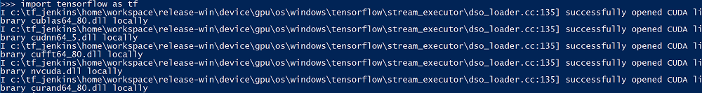
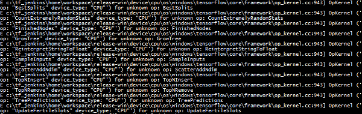

## Set up TensorFlow

### Set up TensorFlow on Windows Machines

The following steps have been tested on Windows 10 computers. 

### 1. Install Anaconda (Python 3.5)

As of March 21, 2017, the most updated Python 3 version is Python 3.6. However, TensorFlow only works directly on Python 3.5. You need to download and install Anaconda (Anaconda3-4.2.0 is for Python 3.5) from the [Anaconda Installer Archive](https://repo.continuum.io/archive/Anaconda3-4.2.0-Windows-x86_64.exe). 

### 2. Run the following command to install TensorFlow

This instruction is based on a thread in [stackoverflow](http://stackoverflow.com/questions/42755129/installing-tensorfow-not-supported-wheel).

		conda create --name tensorflow python=3.5
		activate tensorflow
		conda install jupyter
		conda install scipy
		pip install tensorflow #if you want to run TensorFlow on CPU machines
		# or, run the following command if you want to run TensorFlow on GPU machines
		# pip install tensorflow-gpu

### 3. (Optional) Launch Jupyter Notebook server
	
If you would like to use Jupyter Notebooks to develop your Python scripts, you can launch your Jupyter Notebook server by running the following commands:

		# make a directory to be your home directory of your Jupyter Notebooks
		mkdir C:\DeepLearning
		cd C:\DeepLearning
		<path to your Anaconda3 installation>\Scripts\jupyter notebook

Then, you can access your Jupyter Notebook via a browser using the following url: _**localhost:8888**_

### 4. (Required for TensorFlow on GPU) Install CUDA toolkit and deep learning toolkit

These two toolkits are needed if you want to run TensorFlow on GPU. 

Click the [CUDA toolkit link](https://developer.nvidia.com/cuda-downloads), select the operating system of your machine, download the installer, and install the CUDA toolkit. 

The deep learning toolkit (cudnn) has different versions. To know which version is needed to run your tensorflow, you can first launch your Python console, and run the following command:

	import tensorflow as tf

If you see that all needed libraries are loaded successfully, your TensorFlow on GPU has been installed successfully. Otherwise, if you see an error complaining that _cudnn64\_5.dll_ cannot be found, take the following steps:

- Go to the [download page](https://developer.nvidia.com/rdp/cudnn-download)
 
- Select _***Download cuDNN v5.1 (Jan 20, 2017), for CUDA 7.5***_. 

>[NOTE] If when you import tensorflow in Python, you see an error complaining that _cudnn64\_6.dll_ cannot be found, you should select _***Download cuDNN v5.1 (Jan 20, 2017), for CUDA 8.0***_.
 
- Select the operating system of your machine and download the zip file.

- Unzip it to a local directory (for instance, C:\tools). After unzipping, you should be able to see _cudnn64\_5.dll_ in _C:\tools\cuda\bin_.

- Run the following Powershell command to add the path to _cudnn64\_5.dll_ (_C:\tools\cuda\bin_ in this example) to the system path

		[Environment]::SetEnvironmentVariable( "Path", $env:Path+";C:\tools\cuda\bin", [System.EnvironmentVariableTarget]::Machine )

>[NOTE]You might need to reopen your Powershell window in order for this change being recognized by Powershell. 

### 5. Test whether your TensorFlow is installed successfully

Run the following Python scripts to test whether your TensorFlow is installed successfully.
 
		import tensorflow as tf
		hello = tf.constant('Hello Hang, Welcome to TensorFlow!')
		sess = tf.Session()
		print(sess.run(hello))

If you see _**b'Hello Hang, Welcome to TensorFlow!'**_ in result, that means your TensorFlow is installed properly. When you run these scripts for the first time, there will be some warnings in your Python console like the following image. No need to worry about them.  

